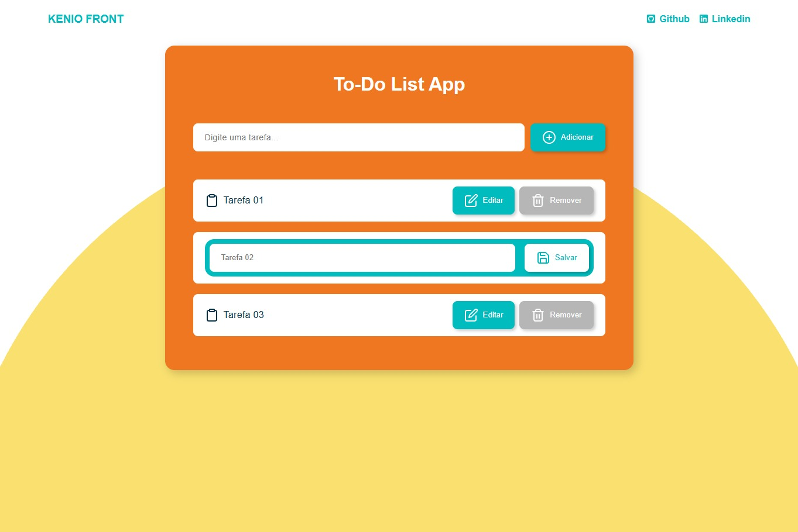

# 📝 To Do List App

> Aplicativo de lista de tarefas desenvolvido com React, permitindo adicionar, editar e remover tarefas, com persistência de dados utilizando localStorage para manter as informações mesmo após atualização da página.

[](https://keniofront.github.io/mini-todo-react/)



## 📋 Sobre o Projeto

Projeto pessoal desenvolvido como prática de React e gerenciamento de estado, focado em criar uma aplicação simples e funcional para organização de tarefas. A interface é responsiva e intuitiva, demonstrando habilidades em front-end moderno e boas práticas de desenvolvimento.

## 🚀 Tecnologias Utilizadas

- **React** - Biblioteca para construção da interface
- **Vite** - Ferramenta de build e desenvolvimento
- **pnpm** - Gerenciador de pacotes

## ⚡ Principais Features

- Adicionar, editar e remover tarefas
- Persistência de dados usando localStorage
- Interface limpa, moderna e responsiva
- Gerenciamento de estado eficiente com React
- Componentização reutilizável para melhor organização do código

## 🔧 Como Executar

```bash
# Clone o repositório
git clone https://github.com/keniofront/mini-todo-react.git

# Acesse o diretório
cd mini-todo-react

# Instale as dependências
pnpm install

# Execute o projeto
pnpm run dev
```

## 📱 Compatibilidade

- ✅ **Responsivo**: Desktop, Tablet, Mobile
- ✅ **Browsers**: Chrome, Firefox, Safari, Edge
- ✅ **API**: OMDb API (https://www.omdbapi.com/)

## 💡 Aprendizados

- Gerenciamento de estado e atualização da interface
- Uso de localStorage para persistência de dados
- Componentização e boas práticas de estruturação de projetos
- Desenvolvimento com React e Vite

## 🎯 Objetivo

Este projeto foi desenvolvido para demonstrar competências técnicas em:

- Desenvolvimento React focado em funcionalidades práticas
- Criação de interfaces responsivas e interativas
- Boas práticas de organização e componentização
- Persistência de dados no front-end com localStorage

## 🤝 Contribuição

Este é um projeto de portfólio, mas sugestões e feedbacks são sempre bem-vindos! Entre em contato para discussões técnicas ou oportunidades profissionais.

## 📞 Contato

- **LinkedIn**: https://www.linkedin.com/in/keniofront/
- **Email**: keniofront@gmail.com

---

**Desenvolvido com 💙 para fins educacionais e demonstração de habilidades técnicas.**
